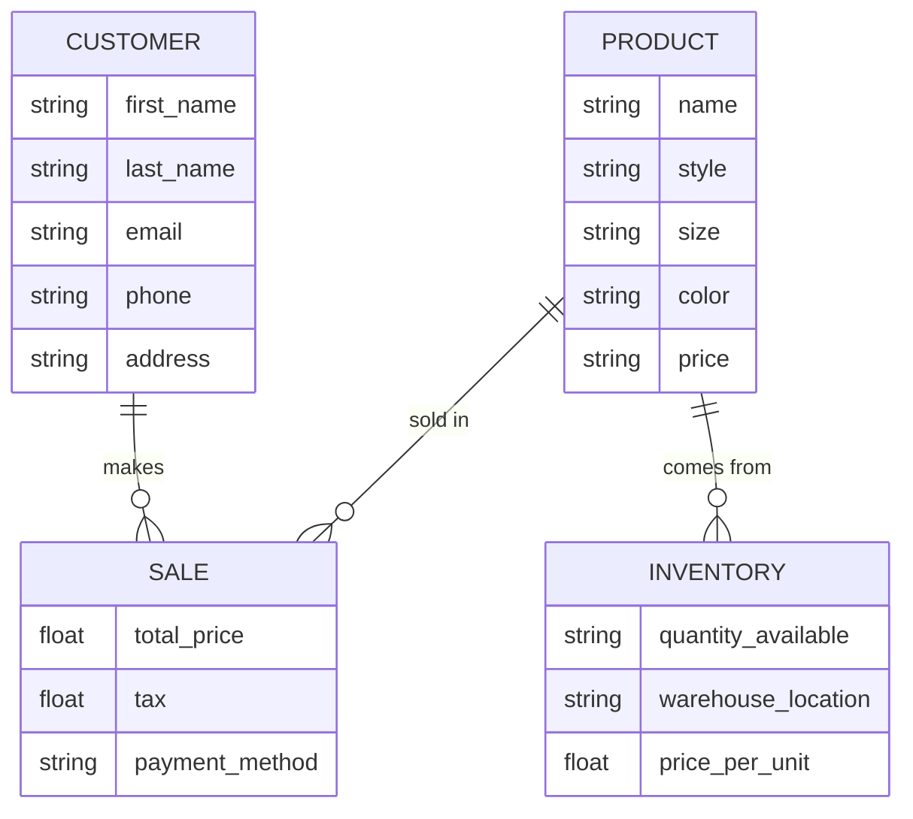

### Description of Diagram
* The product is what is (in this case shoes) sold to make the sale which generates profit for the company. 
* The customer completes a payment for the product which generates a sale, which is how a company makes its money. 
* The product is stored in the inventory before being sold. It is later shipped to the customer after the sale happens. 
